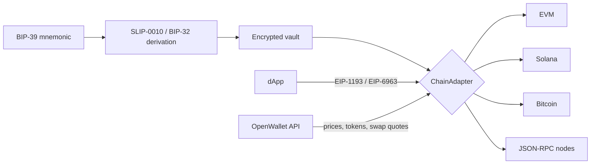

<p align="center">
  <a href="https://redduck.io/?utm_source=github&amp;utm_medium=readme&amp;utm_campaign=open-wallet">
    <picture>
      <source media="(prefers-color-scheme: dark)" srcset=".github/assets/redduck-logo-dark.svg">
      
    </picture>
  </a>
</p>

<h1 align="center">OpenWallet</h1>

<p align="center">
  <b>A non-custodial, multi-chain browser wallet — one seed, one signing model, across EVM, Solana and Bitcoin.</b>
</p>

---

OpenWallet is a browser-extension wallet built in the open: a BIP-39 seed, SLIP-0010/BIP-32 derivation, an encrypted-at-rest vault, and per-chain signing behind a single `ChainAdapter` contract, so EVM, Solana and Bitcoin are driven by exactly the same send flow. Keys never leave the extension's background worker — dApps talk to it over EIP-1193/EIP-6963, and price, token and swap data comes from a stateless API that never sees a key. Every primitive either wraps an audited library (`@noble/*`, `@scure/*`, `viem`, `bitcoinjs-lib`, `@solana/web3.js`) or, where implemented here (SLIP-0010 derivation), is verified against the official spec test vectors. See [docs/architecture.md](docs/architecture.md) for the security invariants and how to add a chain.

## Built with

| Area         | Technology                                                                              |
| ------------ | --------------------------------------------------------------------------------------- |
| Language     | TypeScript (Node.js ≥ 20, `strict`, type-aware ESLint)                                  |
| Extension    | [WXT](https://wxt.dev) + React 19, Tailwind CSS 4, Radix UI                             |
| Cryptography | [`@noble/*`](https://github.com/paulmillr/noble-hashes) / `@scure/*`                    |
| EVM          | [viem](https://viem.sh) — signing, ERC-20, fee tiers, ENS                               |
| Solana       | [`@solana/web3.js`](https://solana-labs.github.io/solana-web3.js/) — SPL, priority fees |
| Bitcoin      | [bitcoinjs-lib](https://github.com/bitcoinjs/bitcoinjs-lib) — native SegWit, PSBT, RBF  |
| Swaps        | [LI.FI](https://li.fi) (EVM) and [Jupiter](https://jup.ag) (Solana)                     |
| Backend      | [NestJS](https://nestjs.com) 11 with [Zod](https://zod.dev) request/response contracts  |
| Tooling      | pnpm workspaces, Vitest, Prettier, Knip                                                 |

## How it works



1. A mnemonic is generated or imported, then encrypted into a vault that only decrypts with the user's password — the plaintext seed never touches disk.
2. Accounts are derived per chain from that one seed (secp256k1 for EVM and Bitcoin, ed25519 for Solana), each following its chain's SLIP-44 path convention.
3. Every chain package exposes the same `ChainAdapter`: derive, validate, quote fees, build, sign, broadcast. The UI and the dApp bridge only ever talk to that interface, so adding a chain doesn't touch the send flow.
4. Signing happens in the extension's background worker behind an auto-lock; the injected page provider relays requests but never holds key material.

## Workspace

| Package                                                 | What it is                                                                 |
| ------------------------------------------------------- | -------------------------------------------------------------------------- |
| [`@openwallet/core`](packages/core)                     | Mnemonic, HD/SLIP-10 derivation, encrypted vault, keyring, `ChainAdapter`  |
| [`@openwallet/chain-evm`](packages/chain-evm)           | EVM derivation, signing, ERC-20 transfers, fee tiers, ENS, speed-up/cancel |
| [`@openwallet/chain-solana`](packages/chain-solana)     | Solana derivation, signing, SPL transfers, fee tiers                       |
| [`@openwallet/chain-bitcoin`](packages/chain-bitcoin)   | Bitcoin (native SegWit) derivation, PSBT signing, RBF, message signing     |
| [`@openwallet/api-contract`](packages/api-contract)     | Zod schemas shared by the API and its consumers                            |
| [`@openwallet/lifi-client`](packages/lifi-client)       | LI.FI quotes and token lists for EVM swaps                                 |
| [`@openwallet/jupiter-client`](packages/jupiter-client) | Jupiter quotes and token lists for Solana swaps                            |
| [`@openwallet/extension`](apps/extension)               | The browser extension: onboarding, accounts, send, swap, dApp approvals    |
| [`@openwallet/api`](apps/api)                           | NestJS service for prices, tokens and swap routing — stateless, key-free   |

**Dependency direction is `chain-* → core` only.** `core` never imports a chain package and chain packages never import each other; ESLint enforces it rather than leaving it to convention.

## Getting started

Prerequisites: Node.js ≥ 20 and [pnpm](https://pnpm.io) 10.

```bash
pnpm install
pnpm build       # compile every package
pnpm test        # vitest across the workspace
pnpm check       # format + build + lint + typecheck + knip + test
```

Run the extension in watch mode — WXT opens a browser with it loaded; `build` instead emits `apps/extension/.output/chrome-mv3` to load unpacked yourself:

```bash
pnpm --filter @openwallet/extension dev
pnpm --filter @openwallet/extension build
```

Run the API alongside it:

```bash
pnpm --filter @openwallet/api dev
```

Contributions are welcome — see [CONTRIBUTING.md](CONTRIBUTING.md).

## License

[MIT](LICENSE) © RedDuck Limited
